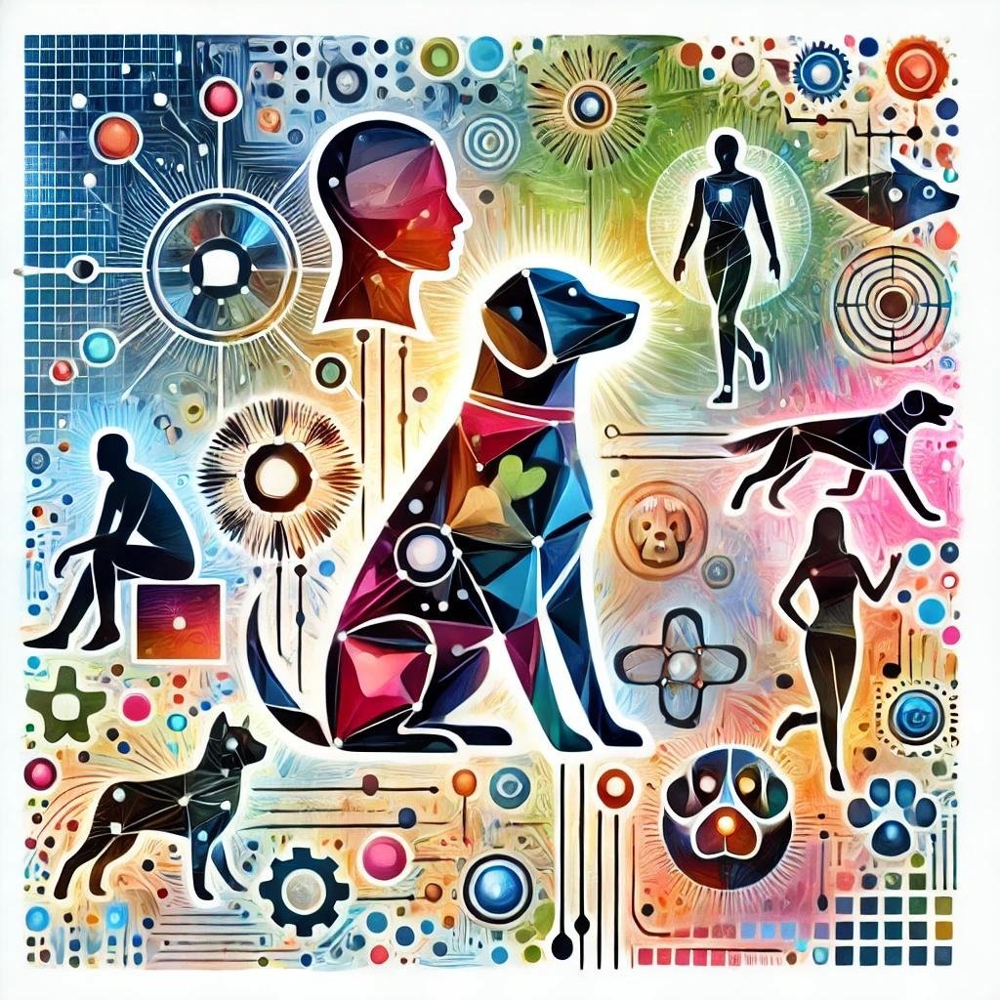

## Motivation for the project
In this project, machine learning algorithms are used to distinguish humans from dogs, to recognize dog breeds, and to suggest suitable dog breeds for humans.

Therefore, a Flask based Web App for a ResNet50 based identification of dogs, a Multi-Task Cascaded Convolutional Networks (MTCNN) [1] based identification of humans and a Convolutional Neural Network (Xception [2]) based classification of dog breeds for dogs and humans are used.

This project demonstrates how machine learning can be creatively applied to image processing. Feedback and suggestions are warmly welcome!
The project was implemented as Capstone project of [Udacity Data Scientist](https://www.udacity.com/course/data-scientist-nanodegree--nd025) Training. 

  

## Summary of the results
Three pre-trained networks were used in this project. The Xception [2] network for dog breed classification was extended and trained with a dataset consisting of 133 total dog categories.
The results of the networks are as follows
- Out of 13,233 humans, 99.99 % were correctly classified as humans.
- Out of 100 dogs, 100 % were correctly classified as dogs.
- Out of 836 dogs, 82.06 % of the dog breeds were correctly classified.

## Project Definition 
This project focuses on image processing for classification tasks. The project can be divided into three subtasks. First, classifiying humans in images. Second, classifiying dogs in images and third, classifiying dog breeds from images.
The basis for this task is a dataset containing a total of 8,351 dog images and a second dataset containing a total of 13,233 human images. The dog dataset is divided into 6,680 training dog images, 835 validation dog images, 836 test dog images. For the classification tasks, three neural network classifiers should be used. Each classifier is used for one of the three tasks. As these are classification tasks, the accuracy metric is used to measure the performance of the three classifiers.

## Analysis
The analysis part is divided into the three subtasks.
### Detecting humans
In this project, an OpenCV's implementation of [Haar feature-based cascade classifiers](https://docs.opencv.org/3.4/d1/dfb/intro.html) to detect human faces in images is provided and can be used. This approach requires a preprocessing to convert the images to grayscale before classification. This approach has some disadvantages since faces can only be recognized if they are not covered and directly look into the camera. Therefore, an improved approach is used to detect humans in this project. The advantage of using the MTCNN [1] is the better performance in recognizing faces which are not looking directly into the camera. From the given human images dataset, 99.99 % out of 13,233 humans were correctly classified as humans. Whereas only 98.72 % are classified as humans using the OpenCV's implementation.

To quantify also false positive classifications (dogs as humans), I passed in the complete dog dataset to the MTCNN [1]. Out of 8,351 dog images, 14.61 % were classified as humans.

### Detecting dogs
To detect dogs, a pre-trained [ResNet-50](https://www.tensorflow.org/api_docs/python/tf/keras/applications/ResNet50) model is used which was trained on the [ImageNet](https://www.image-net.org/download.php) dataset. In order to be able to make classifications with this model, preprocessing of images is requried. An image needs to be resized to 244 x 244 pixels, the color planes needs to be reordered from RGB to BGR and the image needs to be normalized. Further, the model requires an 4D tensor as input. For a single image, the tensor has the form (1, 224, 224, 3) - where 1 stands for the one image example, 224 x 224 represent the spatial dimensions and 3 are the color planes (BGR). A performance test of the dog detection was done with a smaller dataset of 100 dog images and 100 human images. All dog images are classified correctly as dogs, and all human images are classified correctly as no dogs.

### Classify Dog Breeds
In this subtask, dog breeds should be classified. The approach was to build a CNN from scratch first and to achieve at least 1 % accuracy in dog breed classification. To improve the results and to enhance training time, a CNN was provided by Udacity where the transfer learning was described. The final task of this chapter was to apply the transfer learning on a model of my choice and to achieve at least 60 % accuracy in dog breed classifications.

#### CNN from scratch
To reach at least 1% of accuracy on the test data, I created a CNN which can be seen in the screenshot below. 
I used different layers which functionality can be seen in the list below:
- Convolutional layers (Conv2D) extract features such as edges, colors, and complex patterns.
- Pooling layers (MaxPooling2D) reduce the spatial size of the features to prevent overfitting and optimize computational performance.
- Flatten converts the feature maps into a format that can be processed by fully connected layers.
- Fully connected layers (Dense) learn the relationships between the extracted features and help in classification.
- Dropout is added to prevent overfitting.
- The Softmax layer outputs the probabilities for each of the 133 dog breeds.

I started with a small convolutional layer to extract 16 parameters from the 3x3 pixel, and then in the second and third convolutional layer, I extended the parameters to 32 and 64 to extract more complex features from the picture. In between each convolutional layer, I added pooling layers as they are useful to reduce the number of parameters and therefore increase efficiency of the model as well as reducing the risk of overfitting. I also use a layer to flatten the output from the convolutional layers to be able to feed it into a fully connected layer. I use two dense layers to process the features from the previous layers. In between the dense layers, I inserted a dropout layer to reduce the risk of overfitting and to improve the generalization possibility of the network. As activation functions, I choose the relu function except for the last layer where I use a softmax function for the classification task. The relu function introduces non-linearities and improves training. The softmax function provides a probability which results in the sum of one over all outputs. Each output equals the probability for one dog breed.

  

I decided to use a Adam optimizer with a learning rate of 0.001 to train this network for 5 epochs only on the dog training data to save time, since I did the training locally on my laptop. I was able to achieve an accuracy of 2.46 % on the test data which is quite good.

#### Provided CNN learning how to use transfer learning
The second model is based on a from Udacity provided model which is a pre-trained VGG-16 model. For the classification job of dog breeds, the model is loaded and extended by one pooling layer and a dense layer with softmax activation to get the probability for each dog breed as shown in the screenshot below.

  

This model is trained with a rmsprop optimizer for 20 epoches with a batch size of 20 images. During training I used a callback to save the weights for the best model only. With this setup I was able to achieve an accuracy of 70.57 % on the test data, which is more accurate compared to the CNN build from scratch.

#### Create CNN using transfer learning
The third model to classify dog breeds should use transfer learning and could be based on VGG-19, ResNet-50, Inception or Xception [2]. I choose the Xception [2] model because it is a further development of the Inception (GoogLeNet) architecture, in which the idea of Inception blocks has been optimized through the use of Depthwise Separable Convolutions. On top of the Xception [2] model, I placed one pooling layer and two dense layers with 800 and 128 neurons to classify the dog breeds. In between these layers, there are two dropout layers to reduce overfitting. The last layer is a softmax activated layer to classify the dog breed as can be seen in the screenshot below.

  

This model is trained with a Adam optimizer for 20 epochs with a batch size of 20 images. During training I also used a callback to save the weights for the best model only. The training and validation accuracy and loss can be seen in the screenshot below.

  

The visualization of the training over the epochs shows a characteristic overfitting where the training losses continue to increase while the validation losses flatten out and increase again. This is something we could improve in the future.
The accuracy of this model on the test dataset is 82.06 %. This exceeds the requirement for an accuracy of at least 60 %.

## Conclusion
To detect dogs and humans and the dog breed of the dog and human was an exciting project. In particular, detecting the dog breed a human look-alike is a fun use case.

The used model for classifiying the dog breed could be futher improved. For example by integrating even more dropouts to strengthen the model's abstraction capability or by experimenting with different architectures and compilation settings to see if we can increase accuracy. Further, we could analyze the training data in more detail and make sure it is balanced before training takes place. The training could also take place on a dataset which maps human faces to dog breeds if such dataset is available, to improve the ability to predict human alike dog breeds.

To provide an easy way to use the models, a Flask web app is build that loads the models for human classification, dog classification and dog breed classification. The web app can be used to detect the appropriate dog breed. The user interface can be seen below.

  

## File descriptions
Below a brief description of the directories and the files of this repo.

- `bottleneck_features`: The bottleneck features which are used in the 'dog_app' notebook are stored in here (not in GIT since to large). Can be downloaded [VGG-19](https://s3-us-west-1.amazonaws.com/udacity-aind/dog-project/DogVGG19Data.npz), [ResNet-50](https://s3-us-west-1.amazonaws.com/udacity-aind/dog-project/DogResnet50Data.npz), [Xception](https://s3-us-west-1.amazonaws.com/udacity-aind/dog-project/DogXceptionData.npz)  
- `dog_images_complete`: Images of dogs for training, validating and testing. (not in GIT since to large). Can be downloaded [here](https://s3-us-west-1.amazonaws.com/udacity-aind/dog-project/dogImages.zip)  
  &nbsp;| - `dogImages`  
  &nbsp;| -- `test`    
  &nbsp;| -- `train`  
  &nbsp;| -- `valid`  
- `haarcascades`  
  &nbsp;| - `haarcascade_frontalface_alt.xml`: Model weights for OpenCV's implementation of Haar feature-based cascade classifiers  
- `human_files_directory`: Images of humans used for testing the OpenCV's and MTCNN (Multi-Task Cascaded Convolutional Networks) Classifier (not in GIT since to large). 
- `images`: Images used in the `dog_app` notebook and `readme.md`  
- `saved_models`  
  &nbsp;| - `Xception.keras`: Trained pre-trained Xception GoogLeNet model for dog breed classification  
  &nbsp;| - `weights.best.VGG16.keras`: Trained pre-trained VGG-16 model for dog breed classification. (not in GIT since to large)  
- `test_images`: Images of dogs, a landscape, a cat and a human to test dog, human and dog breed classification. 
- `Webapp` : Web app which can be used for dog human and dog breed classification  
  &nbsp;| - `app`  
  &nbsp;| - `README`    
  &nbsp;| -- `models_data`  
  &nbsp;| -- `dog_names.csv`  
  &nbsp;| -- `Xception.keras`  
  &nbsp;| -- `templates`  
  &nbsp;| -- `go`  
  &nbsp;| -- `master`  
  &nbsp;| -- `extract_bottleneck_features.py`  
  &nbsp;| -- `requirements`  
  &nbsp;| -- `run.py`  
- `Dependencies.txt`: All installed packages in python environment
- `dog_app.ipynb`: Jupyter notebook used for implementation of this project
- `dog_app.html`: Jupyter notebook used for implementation of this project as html
- `extract_bottleneck_features`: library used in dog_app notebook
- `LICENSE`: M0xB24 License
- `README.md`: Readme file

## Libraries used
- Adam
- Conv2D
- csv
- cv2
- decode_predictions
- Dense
- Dropout
- extract_bottleneck_features
- Flatten
- glob
- GlobalAveragePooling2D
- ImageFile
- image
- keras
- load_model
- matplotlib
- MaxPooling2D
- ModelCheckpoint
- MTCNN
- numpy
- PIL
- preprocess_input
- random
- ReduceLROnPlateau
- ResNet50
- Sequential
- sklearn
- tensorflow
- to_categorical
- tqdm
- urllib
- zipfile

## References

- **[1]** K. Zhang, Z. Zhang, Z. Li, Y. Qiao, "[Joint Face Detection and Alignment Using Multitask Cascaded Convolutional Networks](https://pypi.org/project/mtcnn/#:~:text=Original%20MTCNN%20Implementation%20by%20Kaipeng%20Zhang)", *IEEE Signal Processing Letters*, vol. 23, no. 10, pp. 1499-1503, 2016, [Original MTCNN Implementation by Kaipeng Zhang](https://github.com/kpzhang93/MTCNN_face_detection_alignment/tree/master/code), -[Facenet's MTCNN implementation](https://github.com/davidsandberg/facenet/tree/master/src/align).

- **[2]** François Chollet, "[Xception: Deep Learning with Depthwise Separable Convolutions](https://arxiv.org/abs/1610.02357)", *arXiv*, 2017.

## Third party licenses
- Copyright (c) 2017 Udacity, Inc.

  Permission is hereby granted, free of charge, to any person obtaining a copy
of this software and associated documentation files (the "Software"), to deal
in the Software without restriction, including without limitation the rights
to use, copy, modify, merge, publish, distribute, sublicense, and/or sell
copies of the Software, and to permit persons to whom the Software is
furnished to do so, subject to the following conditions:

  The above copyright notice and this permission notice shall be included in all
copies or substantial portions of the Software.

  THE SOFTWARE IS PROVIDED "AS IS", WITHOUT WARRANTY OF ANY KIND, EXPRESS OR
IMPLIED, INCLUDING BUT NOT LIMITED TO THE WARRANTIES OF MERCHANTABILITY,
FITNESS FOR A PARTICULAR PURPOSE AND NONINFRINGEMENT. IN NO EVENT SHALL THE
AUTHORS OR COPYRIGHT HOLDERS BE LIABLE FOR ANY CLAIM, DAMAGES OR OTHER
LIABILITY, WHETHER IN AN ACTION OF CONTRACT, TORT OR OTHERWISE, ARISING FROM,
OUT OF OR IN CONNECTION WITH THE SOFTWARE OR THE USE OR OTHER DEALINGS IN THE
SOFTWARE.

